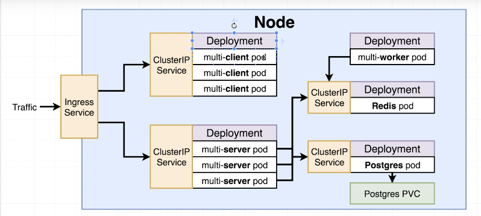

# Deploy complex project in Kubernetes

## Architecture




## Applying multiple files in Kubernetes

First delete old objects

```
$ kubectl get deployments
NAME                READY   UP-TO-DATE   AVAILABLE   AGE
client-deployment   1/1     1            1           23h

$ kubectl delete deployment client-deployment
deployment.apps "client-deployment" deleted

$ kubectl get deployments
No resources found in default namespace.

$ kubectl get services
NAME               TYPE        CLUSTER-IP       EXTERNAL-IP   PORT(S)          AGE
client-node-port   NodePort    10.103.113.235   <none>        3050:31515/TCP   3d20h
kubernetes         ClusterIP   10.96.0.1        <none>        443/TCP          4d22h

$ kubectl delete service client-node-port
service "client-node-port" deleted

$ kubectl get services
NAME         TYPE        CLUSTER-IP   EXTERNAL-IP   PORT(S)   AGE
kubernetes   ClusterIP   10.96.0.1    <none>        443/TCP   4d22h

```

- Apply all config files at the same time
```
$ cd projects/complexk8s/

$ kubectl apply -f k8s
service/client-cluster-ip-service created
deployment.apps/client-deployment created
service/server-cluster-ip-service created
deployment.apps/server-deployment created

$ kubectl get deployments
NAME                READY   UP-TO-DATE   AVAILABLE   AGE
client-deployment   0/3     3            0           0s
server-deployment   0/3     3            0           0s

$ kubectl get pods
NAME                                 READY   STATUS    RESTARTS   AGE
client-deployment-5f9f5b6bfb-l8r22   1/1     Running   0          104s
client-deployment-5f9f5b6bfb-p2ll6   1/1     Running   0          104s
client-deployment-5f9f5b6bfb-tcxf5   1/1     Running   0          104s
server-deployment-69645f89d9-8bmv7   1/1     Running   0          104s
server-deployment-69645f89d9-gtqbp   1/1     Running   0          104s
server-deployment-69645f89d9-xjb6k   1/1     Running   0          104s

$ kubectl get services
NAME                        TYPE        CLUSTER-IP       EXTERNAL-IP   PORT(S)    AGE
client-cluster-ip-service   ClusterIP   10.100.180.157   <none>        3000/TCP   2m4s
kubernetes                  ClusterIP   10.96.0.1        <none>        443/TCP    4d22h
server-cluster-ip-service   ClusterIP   10.109.94.11     <none>        5000/TCP   2m4s

```

## Reapplying a Batch of config files

```
$ kubectl apply -f k8s
service/client-cluster-ip-service unchanged
deployment.apps/client-deployment unchanged
service/server-cluster-ip-service unchanged
deployment.apps/server-deployment unchanged
deployment.apps/worker-deployment created

$ kubectl get deployments
NAME                READY   UP-TO-DATE   AVAILABLE   AGE
client-deployment   3/3     3            3           9m13s
server-deployment   3/3     3            3           9m13s
worker-deployment   1/1     1            1           30s

$ kubectl get pods
NAME                                 READY   STATUS    RESTARTS   AGE
client-deployment-5f9f5b6bfb-l8r22   1/1     Running   0          9m41s
client-deployment-5f9f5b6bfb-p2ll6   1/1     Running   0          9m41s
client-deployment-5f9f5b6bfb-tcxf5   1/1     Running   0          9m41s
server-deployment-69645f89d9-8bmv7   1/1     Running   0          9m41s
server-deployment-69645f89d9-gtqbp   1/1     Running   0          9m41s
server-deployment-69645f89d9-xjb6k   1/1     Running   0          9m41s
worker-deployment-7f746f957d-n7fr9   1/1     Running   0          58s

$ kubectl logs server-deployment-69645f89d9-8bmv7

> @ start /app
> node index.js

Listening
Error: connect ECONNREFUSED 127.0.0.1:5432
    at TCPConnectWrap.afterConnect [as oncomplete] (net.js:1137:16) {
  errno: -111,
  code: 'ECONNREFUSED',
  syscall: 'connect',
  address: '127.0.0.1',
  port: 5432
}

```

## Create secret

```
$ kubectl create secret generic pgpassword --from-literal PGPASSWORD=12345asfd
secret/pgpassword created
```

## Applying PVC and variables

```
$ kubectl apply -f k8s
service/client-cluster-ip-service created
deployment.apps/client-deployment configured
persistentvolumeclaim/database-persistent-volume-claim created
service/postgres-cluster-ip-service created
deployment.apps/postgres-deployment created
service/redis-cluster-ip-service created
deployment.apps/redis-deployment created
service/server-cluster-ip-service created
deployment.apps/server-deployment created
deployment.apps/worker-deployment created

$ kubectl get pods
NAME                                  READY   STATUS    RESTARTS   AGE
client-deployment-5f9f5b6bfb-7d6tt    1/1     Running   0          2m17s
client-deployment-5f9f5b6bfb-cg8x5    1/1     Running   0          2m39s
client-deployment-5f9f5b6bfb-x7vfh    1/1     Running   0          12s
postgres-deployment-78bc4cf96-5m2gf   1/1     Running   0          2m39s
redis-deployment-5f458546b8-mjm6d     1/1     Running   0          2m39s
server-deployment-77b8658699-62gpz    1/1     Running   0          2m38s
server-deployment-77b8658699-gp928    1/1     Running   0          2m38s
server-deployment-77b8658699-kw7g8    1/1     Running   0          2m38s
worker-deployment-75d8f9659c-xdxsg    1/1     Running   0          2m38s

$ kubectl get services
NAME                          TYPE        CLUSTER-IP       EXTERNAL-IP   PORT(S)    AGE
client-cluster-ip-service     ClusterIP   10.101.175.68    <none>        3000/TCP   5m50s
kubernetes                    ClusterIP   10.96.0.1        <none>        443/TCP    41h
postgres-cluster-ip-service   ClusterIP   10.96.165.77     <none>        5432/TCP   5m50s
redis-cluster-ip-service      ClusterIP   10.98.239.67     <none>        6379/TCP   5m50s
server-cluster-ip-service     ClusterIP   10.101.177.194   <none>        5000/TCP   5m50s

$ kubectl get deployments
NAME                  READY   UP-TO-DATE   AVAILABLE   AGE
client-deployment     3/3     3            3           25h
postgres-deployment   1/1     1            1           3m2s
redis-deployment      1/1     1            1           3m2s
server-deployment     3/3     3            3           3m2s
worker-deployment     1/1     1            1           3m1s

$ kubectl get secrets
NAME                  TYPE                                  DATA   AGE
default-token-gqcll   kubernetes.io/service-account-token   3      41h
pgpassword            Opaque             

$ kubectl get pvc
NAME                               STATUS   VOLUME                                     CAPACITY   ACCESS MODES   STORAGECLASS   AGE
database-persistent-volume-claim   Bound    pvc-805c5848-ad19-4e60-815c-11bb31db3bd6   1Gi        RWO            standard       3m45s

$ kubectl get pv
NAME                                       CAPACITY   ACCESS MODES   RECLAIM POLICY   STATUS   CLAIM                                      STORAGECLASS   REASON   AGE
pvc-805c5848-ad19-4e60-815c-11bb31db3bd6   1Gi        RWO            Delete           Bound    default/database-persistent-volume-claim   standard                4m4s
```

## Ingress Nginx

```
$ kubectl apply -f https://raw.githubusercontent.com/kubernetes/ingress-nginx/nginx-0.30.0/deploy/static/mandatory.yaml

namespace/ingress-nginx created
configmap/nginx-configuration created
configmap/tcp-services created
configmap/udp-services created
serviceaccount/nginx-ingress-serviceaccount created
clusterrole.rbac.authorization.k8s.io/nginx-ingress-clusterrole created
role.rbac.authorization.k8s.io/nginx-ingress-role created
rolebinding.rbac.authorization.k8s.io/nginx-ingress-role-nisa-binding created
clusterrolebinding.rbac.authorization.k8s.io/nginx-ingress-clusterrole-nisa-binding created
deployment.apps/nginx-ingress-controller created
limitrange/ingress-nginx created

$ minikube addons enable ingress
* The 'ingress' addon is enabled

$ kubectl apply -f k8s
service/client-cluster-ip-service unchanged
deployment.apps/client-deployment unchanged
persistentvolumeclaim/database-persistent-volume-claim unchanged
persistentvolume/database-persistent-volume unchanged
ingress.extensions/ingress-service created
service/postgres-cluster-ip-service unchanged
deployment.apps/postgres-deployment unchanged
service/redis-cluster-ip-service unchanged
deployment.apps/redis-deployment unchanged
service/server-cluster-ip-service unchanged
deployment.apps/server-deployment unchanged
deployment.apps/worker-deployment unchanged

$ kubectl get services
NAME                          TYPE        CLUSTER-IP       EXTERNAL-IP   PORT(S)    AGE
client-cluster-ip-service     ClusterIP   10.111.244.175   <none>        3000/TCP   62m
kubernetes                    ClusterIP   10.96.0.1        <none>        443/TCP    80m
postgres-cluster-ip-service   ClusterIP   10.101.216.81    <none>        5432/TCP   62m
redis-cluster-ip-service      ClusterIP   10.109.172.172   <none>        6379/TCP   62m
server-cluster-ip-service     ClusterIP   10.98.150.186    <none>        5000/TCP   62m
```
# Kubernetes Production Deployment

## Create a GitHub Repository

```
$ git init
Initialized empty Git repository in /home/vagrant/projects/complexk8s/.git/
$ git add .
$ git commit -m "first commit"
git remote add origin git@github.com[master (root-commit) 6f1d799] first commit
:dvilla 43 files changed, 3445 insertions(+)
j create mode 100644 .gitignore
 create mode 100644 Readme.md
 create mode 100644 client/.gitignore
 create mode 100644 client/Dockerfile
 create mode 100644 client/Dockerfile.dev
 create mode 100644 client/README.md
 create mode 100644 client/nginx/default.conf
 create mode 100644 client/package.json
 create mode 100644 client/public/favicon.ico
 create mode 100644 client/public/index.html
 create mode 100644 client/public/manifest.json
 create mode 100644 client/src/App.css
 create mode 100644 client/src/App.js
 create mode 100644 client/src/App.test.js
 create mode 100644 client/src/Fib.js
 create mode 100644 client/src/OtherPage.js
 create mode 100644 client/src/index.css
 create mode 100644 client/src/index.js
 create mode 100644 client/src/logo.svg
 create mode 100644 client/src/registerServiceWorker.js
 create mode 100644 images/Architecture.png
 create mode 100644 k8s/client-cluster-ip-service.yaml
 create mode 100644 k8s/client-deployment.yaml
 create mode 100644 k8s/database-persistent-volume-claim.yaml
 create mode 100644 k8s/database-persistent-volume.yamlm
 create mode 100644 k8s/ingress-service.yaml
 create mode 100644 k8s/postgres-cluster-ip-service.yaml
 create mode 100644 k8s/postgres-deployment.yaml
 create mode 100644 k8s/redis-cluster-ip-service.yaml
 create mode 100644 k8s/redis-deployment.yaml
 create mode 100644 k8s/server-cluster-ip-service.yaml
 create mode 100644 k8s/server-deployment.yaml
 create mode 100644 k8s/worker-deployment.yaml
 create mode 100644 server/Dockerfile
 create mode 100644 server/Dockerfile.dev
 create mode 100644 server/index.js
 create mode 100644 server/keys.js
 create mode 100644 server/package.json
 create mode 100644 worker/Dockerfile
 create mode 100644 worker/Dockerfile.dev
 create mode 100644 worker/index.js
 create mode 100644 worker/keys.js
 create mode 100644 worker/package.json
$ git remote add origin git@github.com:dvillaj/multi-k8s.git
$ git push -u origin master
Counting objects: 50, done.
Delta compression using up to 2 threads.
Compressing objects: 100% (48/48), done.
Writing objects: 100% (50/50), 170.38 KiB | 1.67 MiB/s, done.
Total 50 (delta 10), reused 0 (delta 0)
remote: Resolving deltas: 100% (10/10), done.
To github.com:dvillaj/multi-k8s.git
 * [new branch]      master -> master
Branch 'master' set up to track remote branch 'master' from 'origin'.
$ git remote -v
origin  git@github.com:dvillaj/multi-k8s.git (fetch)
origin  git@github.com:dvillaj/multi-k8s.git (push)
```

## Travis CLI

https://github.com/travis-ci/travis.rb

- Copy service-account.json into /app
- cd projects/complexk8s/
- docker run -it -v $(pwd):/app ruby:2.3 sh
- gem install travis
- travis login
- travis encrypt-file /app/service-account.json -r dvillaj/multi-k8s
- cp service-account.json.enc /app
- rm /app/service-account.json


```
$ cd projects/complexk8s/
$ docker run -it -v $(pwd):/app ruby:2.3 sh
# gem install travis
Fetching addressable-2.4.0.gem
Fetching highline-1.7.10.gem
Fetching net-http-pipeline-1.0.1.gem
Fetching faraday-0.17.3.gem
Fetching net-http-persistent-2.9.4.gem
Fetching multipart-post-2.1.1.gem
Fetching faraday_middleware-0.14.0.gem
Fetching multi_json-1.14.1.gem
Fetching backports-3.16.1.gem
Fetching gh-0.15.1.gem
Fetching launchy-2.4.3.gem
Fetching typhoeus-0.8.0.gem
Fetching travis-1.8.10.gem
Fetching ffi-1.12.2.gem
Fetching websocket-1.2.8.gem
Fetching pusher-client-0.6.2.gem
Fetching ethon-0.12.0.gem
Successfully installed multipart-post-2.1.1
Successfully installed faraday-0.17.3
Successfully installed faraday_middleware-0.14.0
Successfully installed highline-1.7.10
Successfully installed backports-3.16.1
Successfully installed net-http-pipeline-1.0.1
Successfully installed net-http-persistent-2.9.4
Successfully installed addressable-2.4.0
Successfully installed multi_json-1.14.1
Successfully installed gh-0.15.1
Successfully installed launchy-2.4.3
Building native extensions. This could take a while...
Successfully installed ffi-1.12.2
Successfully installed ethon-0.12.0
Successfully installed typhoeus-0.8.0
Successfully installed websocket-1.2.8
Successfully installed pusher-client-0.6.2
Successfully installed travis-1.8.10
17 gems installed
# travis login
Shell completion not installed. Would you like to install it now? |y| y
We need your GitHub login to identify you.
This information will not be sent to Travis CI, only to api.github.com.
The password will not be displayed.

Try running with --github-token or --auto if you don't want to enter your password anyway.

Username: dvillaj@gmail.com
Password for dvillaj@gmail.com: **************
Successfully logged in as dvillaj!
# ls /app
GoogleCloud.md  Readme.md  Udemy.md  client  deploy.sh  images  k8s  server  service-account.json  worker

# travis encrypt-file /app/service-account.json -r dvillaj/multi-k8s
encrypting /app/service-account.json for dvillaj/multi-k8s
storing result as service-account.json.enc
storing secure env variables for decryption

Please add the following to your build script (before_install stage in your .travis.yml, for instance):

    openssl aes-256-cbc -K $encrypted_42099b4af021_key -iv $encrypted_42099b4af021_iv -in service-account.json.enc -out /app/service-account.json -d

Pro Tip: You can add it automatically by running with --add.

Make sure to add service-account.json.enc to the git repository.
Make sure not to add /app/service-account.json to the git repository.
Commit all changes to your .travis.yml.
# ls
app  bin  boot  dev  etc  home  lib  lib64  media  mnt  opt  proc  root  run  sbin  service-account.json.enc  srv  sys  tmp  usr  var
# cp service-account.json.enc /app
# exit

$ rm service-account.json
```